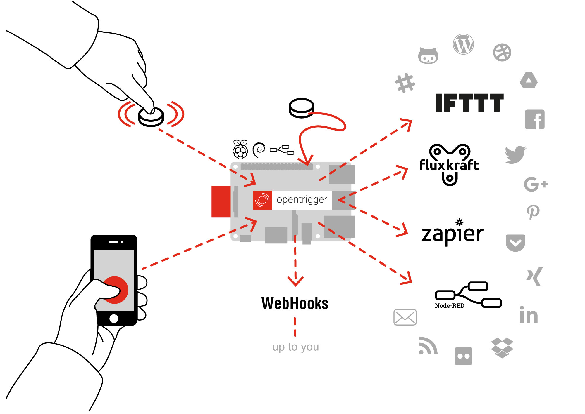

# ((•)) OpenTrigger
Trigger actions online with a simple button. 
Developed and maintained by <a href="https://www.acolono.com">acolono GmbH</a>.

## About

## News
Find out more about the project at our <a href="https://medium.com/open-trigger">Blog</a>

## Repositories

  
[opentrigger](https://github.com/acolono/opentrigger/)  
Overview page of the OpenTrigger project.

  
[opentrigger documentation](https://acolono.gitbooks.io/opentrigger/)  
The documentation of the project in gitbook.

  
[opentrigger-otraw2q](https://github.com/acolono/opentrigger-otraw2q)  
Converts bluetooth dump in hex streams.

  
[opentrigger-distributor](https://github.com/acolono/opentrigger-distributor)  
Filters the messages from the raw channel and creates cleaned and filtered channels for the use with follow-up systems.

  
[opentrigger-nRF51](https://developer.mbed.org/users/0xf10/code/opentrigger-nRF51/)  
Firmware for the [nRF51](https://developer.mbed.org/platforms/Nordic-nRF51-Dongle/) bluetooth hardware device.  

  
[opentrigger-mobilebutton](https://github.com/acolono/opentrigger-mobilebutton)  
Button WebApp for OpenTrigger. Fire up your iOS, Android or Windows Phone WebApp -> Done :).  

Would you like to know [more](http://www.opentrigger.com)?  
Overview of [OpenTrigger Eccosystem & Components](https://github.com/acolono/opentrigger)

OpenTrigger has been sponsored by <a href="http://www.netidee.at/">netidee</a> - powerful innovations
